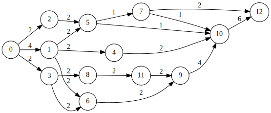
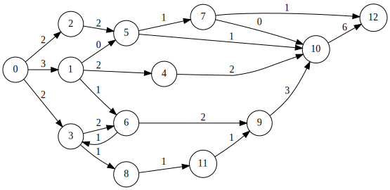
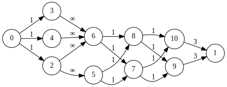
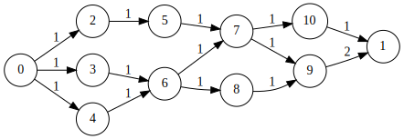

# OCaml project

## Description

Working directory for the 4th year OCaml project. This project consists in implementing a Ford-Fulkerson algorithm to solve the maximum flow problem in OCaml (functional programming language). 

## Project progress

- [x] Minimum acceptable project: (run `make demo`)
- [x] Medium project (Exam scheduling): (run `make schedule`)
- [ ] Better project
  - [x] Enhance medium project: Export results to .csv 
  - [ ] Implement max-flow min-cost algorithm

## Minimum acceptable project

The minimum acceptable project is a program that implements the Ford-Fulkerson algorithm to solve the maximum flow problem. The program should take as input a graph and two nodes, and output the maximum flow between these two nodes.

### Usage

To test the program, run `make demo` in the root directory of the project. This will compile the program and run it on the file set in Makefile.

You can also test the program on a specific file by running `make demo graph=graphname.txt`

There are 10 graphs in the `graphs` directory to test the program on. They are named `graph1.txt` to `graph10.txt`.

### Graph file format

The graph file format is as follows:

```txt
%% Example graph

%% Nodes

n  20 300 0   % This is node #0, with its coordinates (which are not used by the algorithms).
n 200 300 1
n 200 200 2
n 200 400 3
n 380 300 4
n 380 200 5   % This is node #5.


%% Edges (arcs)

e 0 2 0 8     % An arc from 0 to 2, labeled "8". The second 0 is useless.
e 0 3 1 10
e 0 1 2 7
e 2 4 3 12
e 3 4 4 5
e 3 2 5 2
e 3 1 6 11
e 1 4 7 1
e 1 5 8 21
e 4 5 9 14    % An arc from 4 to 5 labeled 14. The 9 is useless.

% End of graph
```

### Example on graph2.txt

Graph2 is the following:


The program outputs the following:
```txt
max flow: 7
```

and the following graph:



## Medium project

For the medium project, we want to solve the exam scheduling problem with the Ford-Fulkerson algorithm. The problem is as follows:

> A university has a set of exams to schedule. Each class has a set of students who are taking the same exam. Each exam is given in a single room. Each room can hold a certain number of students. Each exam has a time slot in which it can be given. A proctor can only supervise one exam at a time. Find a schedule that assignes a class, a room, a time slot, and a proctor to each exam.

In our implementation, we will consider that each exam has a fixed duration and that each proctor can supervise at most 3 exams.

### Usage

To test the program, run `make schedule` in the root directory of the project. This will compile the program and run it on the file set in Makefile.

You can also test the program on a specific file by running `make schedule graph=graphname.txt`

There are a few input files in the `exam_schedule/inputs` directory to test the program on. They are the following:
- `exam_schedule/input1.txt`: It should find a solution with a maximum flow of 3.
- `exam_schedule/input_nosolution.txt`: It should not find a solution.
- `exam_schedule/input_nosolution2.txt`: It should not find a solution because proctors can only supervise 1 exam at a time.

### Input file format

The input file format is as follows:
- `%%` is used to comment a line.
- `c <classname> <number of students>` is used to define a class.
- `r <roomname> <capacity>` is used to define a room.
- `t <timeslot> <duration>` is used to define a timeslot.
- `p <proctorname>` is used to define a proctor.

```txt
%% Example input file

%%classes
c class1 25 
c class2 31 

%%rooms
r room1 26 
r room2 33

%%timeslots
t 14h
t 16h

%%proctors
p name1
```

### Example on input1.txt

Input1 is the following:
```txt
%%classes
c MIC1 25 
c MIC2 31 
c IRB 28

%%rooms
r GEI15 26 
r GEI13 33

%%timeslots
t 14h
t 16h

%%proctors
p Patrick
p Gerard
```

This input is the following graph:


#### Quick explanation of the graph

We give each data line an id. The id is given by the order in which the data is read. 

For easier understanding, we have chosen that 0 is the source node and 1 is the sink node. The other nodes are numbered in the order in which they are read.

You can see 6 columns in the graph:
- The first column is the source node. It has an arc to each class node, with a capacity equal to the number of students in the class.
- The second column is the class nodes. Each class node has an arc to each room node if the room can hold the number of students in the class.
- The third column is the room nodes. Each room node has an arc to each timeslot node.
- The fourth column is the timeslot nodes. Each timeslot node has an arc to each proctor node.
- The fifth column is the proctor nodes. Each proctor node has an arc to the sink node with a capacity of 3 (because a proctor can supervise at most 3 exams at a time).

#### Result
After running the program, the following graph is obtained:


We can see that each class node has an arc to a room node, which has an arc to a timeslot node, which has an arc to a proctor node, which has an arc to the sink node. So each class is assigned a room, a timeslot, and a proctor.

The program also outputs the following csv file:

| Class | Room  | Timeslot | Proctor |
| ----- | ----- | -------- | ------- |
| IRB   | GEI13 | 16h      | Patrick |
| MIC2  | GEI13 | 14h      | Gerard  |
| MIC1  | GEI15 | 14h      | Patrick |


The output of the program is the following:
```txt
Exam schedule:

Class IRB goes in room GEI13 at 16h with Patrick.
Class MIC2 goes in room GEI13 at 14h with Gerard.
Class MIC1 goes in room GEI15 at 14h with Patrick.
```

## Configuration

To use, you should install the *OCaml* extension in VSCode. Other extensions might work as well but make sure there is only one installed.
Then open VSCode in the root directory of this repository (command line: `code path/to/ocaml-maxflow-project`).

Features :
 - full compilation as VSCode build task (Ctrl+Shift+b)
 - highlights of compilation errors as you type
 - code completion
 - automatic indentation on file save


A makefile provides some useful commands:
 - `make build` to compile. This creates an ftest.native executable
 - `make demo` to run the `ftest` program with some arguments
 - `make schedule` to run the `scheduletest` program with some arguments
 - `make format` to indent the entire project
 - `make edit` to open the project in VSCode
 - `make clean` to remove build artifacts

In case of trouble with the VSCode extension (e.g. the project does not build, there are strange mistakes), a common workaround is to (1) close vscode, (2) `make clean`, (3) `make build` and (4) reopen vscode (`make edit`).


## Authors

- [Ronan Bonnet](https://github.com/BloodFutur)
- [Anna Cazeneuve](https://github.com/annzzza)